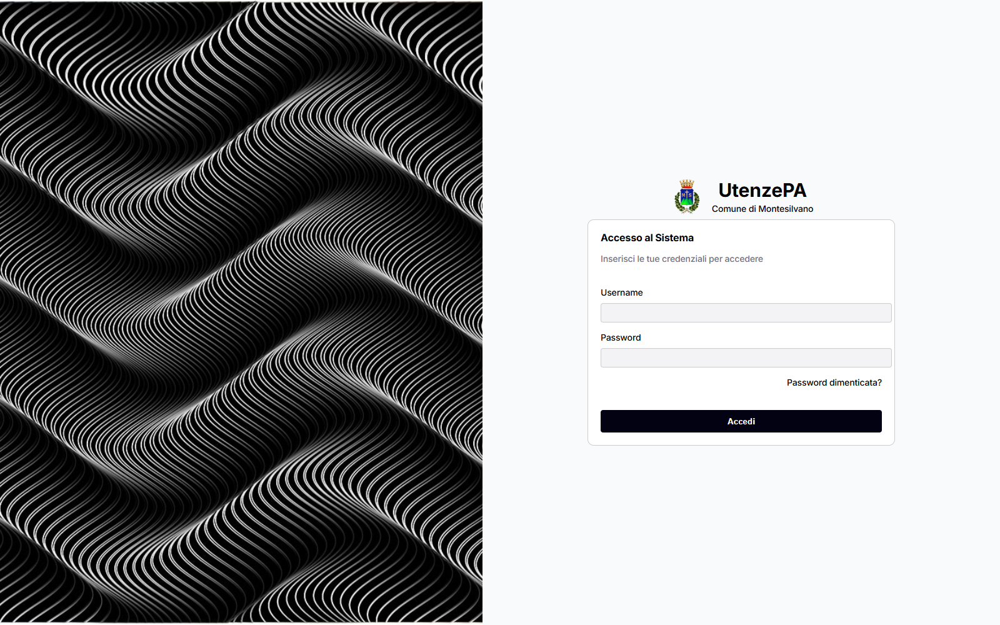
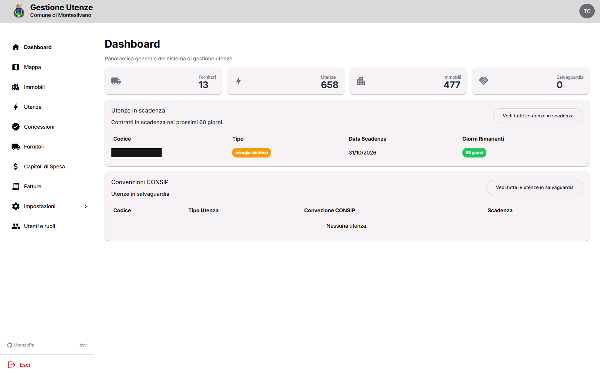
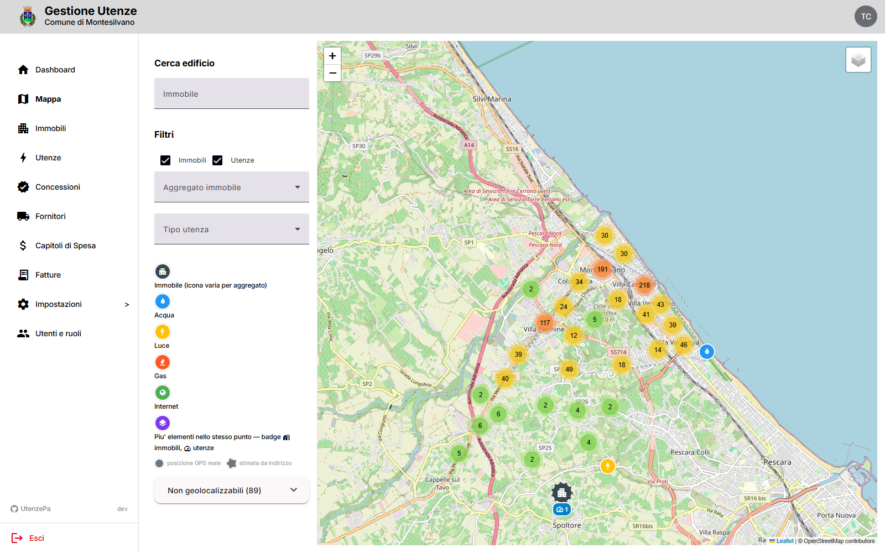
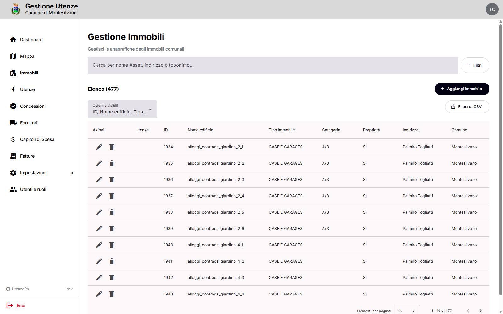
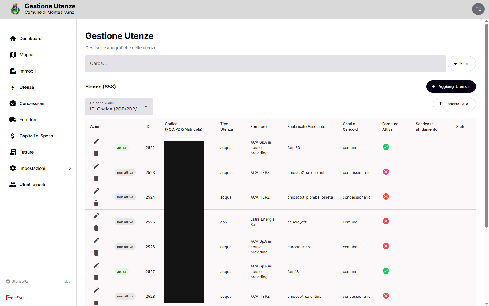

<p align="center">
  
</p>

Gestionale del patrimonio immobiliare e delle utenze per enti pubblici locali (asset, utenze, contratti, fornitori, fatture). Nato per il Comune di Montesilvano, ma l'ente (nome, tipo, coordinate mappa di default, logo, favicon) è configurabile da interfaccia in **Impostazioni > Branding** — nessuna modifica al codice o rebuild necessari per adattarlo a un altro ente.

## Screenshot

| Login | Dashboard |
|---|---|
|  |  |

| Mappa geolocalizzazione | Gestione Immobili |
|---|---|
|  |  |

| Gestione Utenze |
|---|
|  |

## Architettura

Monorepo semplice (nessun workspace tool): `backend/` (NestJS) + `frontend/` (Angular), orchestrati da Docker Compose in root.

| Servizio | Tecnologia | Porta default |
|---|---|---|
| **Backend API** | NestJS 11 (Node ≥24) | 3000 (debug 9229) |
| **Frontend** | Angular 22 + Angular Material | 4300 |
| **Database** | MySQL 8 | 3307 |

## Prerequisiti

- [Docker](https://docs.docker.com/get-docker/) e [Docker Compose](https://docs.docker.com/compose/install/)
- (Opzionale, solo per sviluppo senza Docker) Node.js ≥24 — la versione richiesta da `backend/package.json` può non corrispondere a quella installata sull'host

## Avvio rapido

```bash
git clone https://github.com/Comune-di-Montesilvano/UtenzePA.git
cd UtenzePA

cp .env.example .env
# In sviluppo, scommenta COMPOSE_FILE in .env per attivare l'override
# (build locale + bind mount, invece delle immagini da GHCR)

docker compose up -d
```

Una volta avviati i container:

- **Frontend**: [http://localhost:4300](http://localhost:4300)
- **Backend API**: [http://localhost:3000](http://localhost:3000)
- **Swagger API docs**: [http://localhost:3000/api-docs](http://localhost:3000/api-docs) (solo se `SWAGGER=true`, mai in produzione pubblica)

Al primo avvio, con database vuoto, l'app reindirizza automaticamente al wizard di creazione del primo utente amministratore (`/setup`) — vedi sezione "Bootstrap del primo Admin" più sotto.

## Variabili d'ambiente

Configurazione tramite un file `.env` nella root, copiato da `.env.example` (elenco completo e commentato, fare sempre riferimento a quel file per l'ultima versione aggiornata). Le principali:

### Porte esterne

| Variabile | Default | Descrizione |
|---|---|---|
| `DOCKER_API_PORT` | `3000` | Porta esposta dal backend |
| `DOCKER_FRONTEND_PORT` | `4300` | Porta esposta dal frontend |

### Database MySQL

| Variabile | Default | Descrizione |
|---|---|---|
| `MYSQL_PASSWORD` | _(obbligatoria)_ | Password root MySQL — genera con `openssl rand -hex 24` |
| `MYSQL_DB` | `mydatabase` | Nome del database |

### Secret applicativi (obbligatori in produzione)

| Variabile | Descrizione |
|---|---|
| `JWT_ACCESS_SECRET` | Firma i token JWT — genera con `openssl rand -hex 32` |
| `COOKIE_SECRET` | Firma i cookie — genera con `openssl rand -hex 32` |
| `SETUP_BOOTSTRAP_TOKEN` | Protegge il wizard di creazione del primo Admin — comunicato fuori banda a chi lo esegue |

### Rete / CORS

| Variabile | Descrizione |
|---|---|
| `CORS_ORIGIN` | Origine (o lista separata da virgola) ammessa dal backend — deve combaciare con l'URL reale del frontend visto dal browser |
| `API_URL` | URL del backend raggiungibile dal browser, usato dal frontend a runtime |

### Altro

| Variabile | Default | Descrizione |
|---|---|---|
| `SWAGGER` | `false` | Espone `/api-docs` — mai `true` in produzione pubblica |
| `LOG_LEVEL` | `info` | `error`/`warn`/`info`/`debug`/`verbose` — cambiabile senza rebuild, solo restart |
| `SENTRY_DSN` | _(vuota)_ | DSN Sentry/GlitchTip per error tracking — assente = tracking disabilitato |

## Moduli API

Il backend espone risorse REST sotto `/api/v1`, un modulo NestJS per dominio (`backend/src/apis/`):

| Modulo | Descrizione |
|---|---|
| `auth`, `setup` | Login, reset password, bootstrap del primo Admin |
| `system-users` | Utenti di sistema e ruoli |
| `settings` | Branding ente (nome/tipo, coordinate mappa, logo, favicon) |
| `asset`, `asset-aggregators` | Immobili e loro aggregati |
| `utility`, `utility-types`, `utility-aggregators` | Utenze, tipologie e aggregati |
| `map` | Punti geolocalizzati (immobili + utenze) per la mappa |
| `invoices` | Fatture |
| `contracts` | Contratti (fornitore, CIG, date, cauzione — può coprire più utenze, storicizzato) |
| `suppliers` | Fornitori |
| `budget-chapters` | Capitoli di spesa |
| `consip-agreement` | Convenzioni CONSIP |
| `costs-borne-by` | Oneri a carico di |
| `maintenance-managers` | Fornitori manutenzione |
| `purpose` | Finalità d'uso |
| `utilizer`, `utilizer-grant` | Utilizzatori e concessioni |
| `backup`, `import` | Backup/restore database e importazione dati da file |
| `geocoding` | Geocodifica indirizzi (asset senza coordinate manuali) |
| `health` | Health check |

## Bootstrap del primo Admin

Non esiste un modo per creare un utente amministratore da riga di comando: la creazione utenti (`POST /system-users`) richiede già un Admin autenticato. Il primo Admin si crea tramite il wizard `/setup` (disponibile solo finché il database non ha alcun utente, si disattiva automaticamente dopo):

1. Apri `http://localhost:4300/setup` (o viene reindirizzato lì automaticamente da `/login` finché non esiste alcun utente).
2. Inserisci nome, cognome, email, password e il `SETUP_BOOTSTRAP_TOKEN` configurato in `.env`.
3. Ricevi un codice OTP via email (in sviluppo: [mailpit](http://localhost:8026), porta da `docker-compose.override.yml` — verifica in `.env` se sovrascritta per conflitti con altri progetti locali).
4. Inserisci il codice per completare la creazione dell'Admin.

## Branding

Da `Impostazioni > Branding` (solo ruolo Admin) si configurano, senza toccare codice o rebuild:

- Nome e tipo ente (es. "Comune di Montesilvano" / "Comune")
- Coordinate di default della mappa geolocalizzazione (scelte cliccando su una mini-mappa)
- Logo (mostrato in header e login)
- Favicon (tab del browser)

Il valore di default al primo avvio (seed di migration) è quello del Comune di Montesilvano — cambialo da qui per un altro ente.

## Frontend

Interfaccia in **Angular 22** con **Angular Material**. Sezioni principali (menu laterale):

- **Dashboard**, **Mappa** (geolocalizzazione immobili/contatori)
- **Immobili**, **Utenze**, **Concessioni**, **Fornitori**, **Capitoli di Spesa**, **Fatture**, **Contratti**
- **Impostazioni** — Aggregati Utenze/Immobili, Fornitori Manutenzione, Tipologie uso contatore, Convenzioni CONSIP, Finalità d'uso, Utilizzatori, Backup e Importazione, Branding
- **Utenti e ruoli**

## Sviluppo

Il backend richiede Node ≥24: se l'host locale ha una versione diversa, i comandi vanno lanciati dentro il container (`docker exec utenzepa-api-1 ...` / `utenzepa-frontend-1`), non sull'host — vedi `CLAUDE.md` per i dettagli ed esempi.

### Backend

```bash
cd backend
pnpm install
pnpm run start:dev        # watch mode, porta 3000
```

### Frontend

```bash
cd frontend
pnpm install
pnpm run start             # ng serve, porta 4300
```

### Test (backend)

```bash
cd backend
pnpm run test -- --maxWorkers=2               # tutti gli unit test
pnpm run test:e2e -- --maxWorkers=2            # test/jest-e2e.json
pnpm run test:integration -- --maxWorkers=2    # usa mongodb-memory-server
pnpm run test:cov -- --maxWorkers=2            # con coverage
```

`--maxWorkers=2` sempre: l'ambiente di sviluppo tipico ha poche CPU disponibili, jest di default ne satura quante ne trova.

### Load testing

Il backend include configurazioni [Artillery](https://www.artillery.io/) (`backend/artillery/`):

```bash
cd backend
pnpm run artillery:low      # carico basso
pnpm run artillery:medium   # carico medio
pnpm run artillery:high     # carico alto
pnpm run artillery:massive  # carico massivo
pnpm run artillery:all      # tutti in sequenza
```

## Sicurezza

- Autenticazione JWT — solo access token, nessun refresh token
- OTP via email (non TOTP/app authenticator) per il bootstrap del primo Admin e il reset password — non richiesto al login ordinario
- Hashing password con bcrypt (cost factor 10)
- Header di sicurezza HTTP via [helmet](https://helmetjs.github.io/)
- CORS ristretto a whitelist esplicita (`CORS_ORIGIN`)
- Gestione secret con [Infisical](https://infisical.com/) (opzionale)
- Error tracking con [Sentry](https://sentry.io/) o [GlitchTip](https://glitchtip.com/) (opzionale, via `SENTRY_DSN`)

Non implementati allo stato attuale (nessuna feature di sicurezza aggiuntiva oltre quanto sopra): blocco account dopo tentativi di login falliti, rate limiting sulle API.

## Struttura del progetto

```
UtenzePA/
├── .github/                     # Workflow CI/CD (test, release GHCR, publiccode)
├── docker-compose.yml           # Orchestrazione servizi (produzione)
├── docker-compose.override.yml  # Override sviluppo (build locale, bind mount, mailpit)
├── .env.example                 # Variabili d'ambiente documentate
├── publiccode.yml               # Metadata per il catalogo riuso PA
├── backend/                     # API NestJS
│   ├── src/
│   │   ├── apis/                # Moduli di dominio (controller/service/entity per risorsa)
│   │   ├── common/, helpers/, utils/
│   │   ├── core/                 # Auth, database, cronjobs, email, exceptions
│   │   ├── database/migrations/  # Migration TypeORM + data-source per la CLI
│   │   └── data-importer/        # Service usato da import CSV chunked (UI Backup e Importazione)
│   ├── tools/                    # Script one-off (import dati storici) — mai nell'immagine prod
│   ├── artillery/                # Configurazioni load test
│   └── postman/                  # Collection Postman
└── frontend/                     # App Angular
    └── src/
        ├── app/
        │   ├── pages/             # Pagine (include branding-settings/, setup/)
        │   ├── services/          # Servizi comunicazione API
        │   ├── guards/, layout/, core/
        └── environments/
```

## Contribuire

Prima di aprire una PR:
- lancia `pnpm run lint`/`pnpm run test` (backend) e `pnpm run build` (frontend, se tocchi codice Angular) — dentro il container se l'host non ha Node ≥24
- affidati a CI (`.github/workflows/tests.yml`, gira su ogni push/PR verso `main`) come gate autoritativo prima del merge
- leggi `CLAUDE.md` per le convenzioni del repo e le note operative accumulate

## Licenza

Distribuito sotto licenza [EUPL-1.2](LICENSE).
