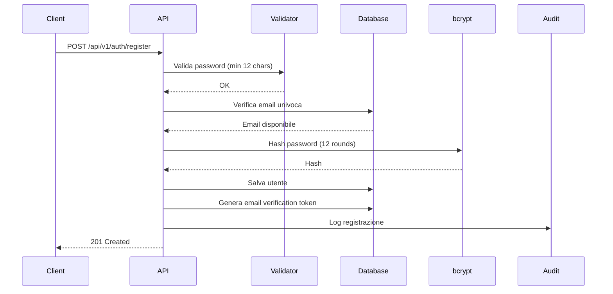
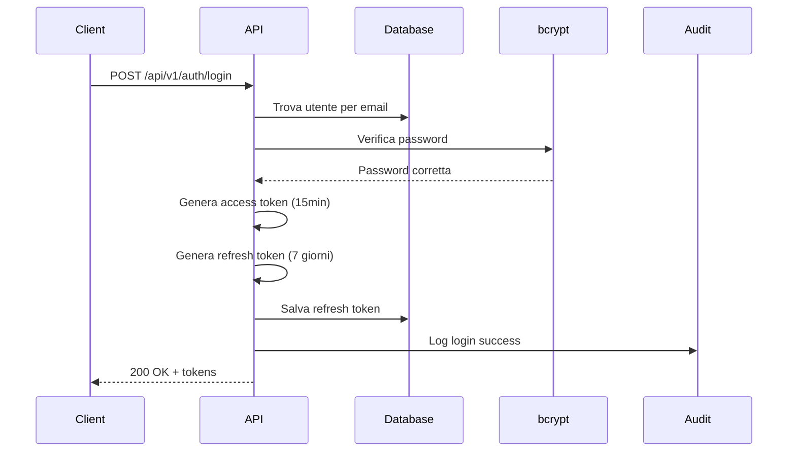
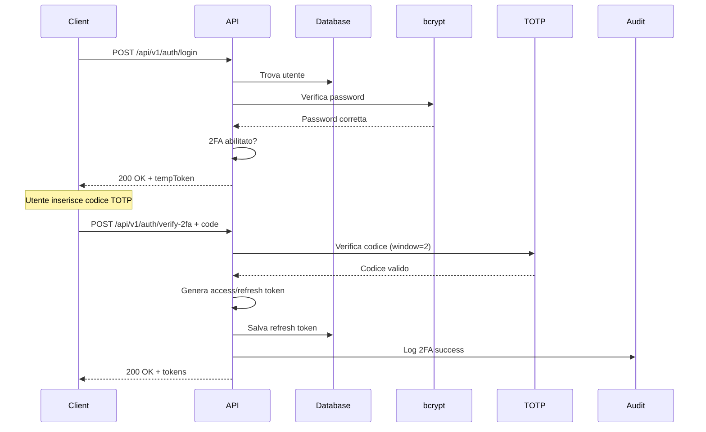

# Authentication System

Documentazione completa del sistema di autenticazione del template NestJS.

## Indice

- [Panoramica](#panoramica)
- [Architettura](#architettura)
- [Flusso di Autenticazione](#flusso-di-autenticazione)
- [API Endpoints](#api-endpoints)
- [JWT Tokens](#jwt-tokens)
- [Two-Factor Authentication (2FA)](#two-factor-authentication-2fa)
- [Security Features](#security-features)
- [Configurazione](#configurazione)
- [Esempi di Utilizzo](#esempi-di-utilizzo)
- [Troubleshooting](#troubleshooting)

## Panoramica

Il sistema di autenticazione è basato su **JWT (JSON Web Tokens)** e supporta:

- ✅ Registrazione utenti con validazione email
- ✅ Login con email e password
- ✅ Two-Factor Authentication (2FA) con TOTP
- ✅ Refresh token con rotazione automatica
- ✅ Logout sicuro con revoca dei token
- ✅ Account locking dopo tentativi falliti
- ✅ Backup codes per 2FA
- ✅ Audit logging di tutte le operazioni di autenticazione
- ✅ Rate limiting su endpoint sensibili
- ✅ Password hashing con bcrypt (12 rounds)
- ✅ Device fingerprinting

## Architettura

### Moduli Principali

```
src/apis/authentication/
├── auth.module.ts              # Modulo principale
├── auth.controller.ts          # REST API endpoints
├── auth.service.ts            # Business logic
├── jwt-tokens.service.ts      # Gestione JWT
├── dto/                       # Data Transfer Objects
│   ├── register.dto.ts
│   ├── login.dto.ts
│   ├── refresh-token.dto.ts
│   └── logout.dto.ts
└── schemas/                   # MongoDB schemas
    ├── refresh-token.schema.ts
    ├── password-reset-token.schema.ts
    └── email-verification-token.schema.ts

src/core/auth/
├── strategies/
│   └── jwt.strategy.ts        # Passport JWT strategy
├── guards/
│   └── jwt-auth.guard.ts      # Route protection
└── decorators/
    └── current-user.decorator.ts

src/core/two-factor-auth/
├── two-factor.service.ts      # TOTP generation/verification
└── backup-codes.service.ts    # Backup codes management
```

### Database Schemas

#### UtilizerGrant Schema
```typescript
{
  email: string (unique, indexed)
  passwordHash: string
  emailVerified: boolean
  twoFactorEnabled: boolean
  twoFactorSecret?: string
  failedLoginAttempts: number
  lockedUntil?: Date
  lastLoginAt?: Date
  isActive: boolean
  createdAt: Date
  updatedAt: Date
}
```

#### RefreshToken Schema
```typescript
{
  userId: ObjectId (indexed)
  tokenHash: string (indexed)
  deviceFingerprint: string
  ipAddress: string
  userAgent: string
  expiresAt: Date (indexed with TTL)
  revoked: boolean
  revokedAt?: Date
  createdAt: Date
}
```

## Flusso di Autenticazione

### 1. Registrazione



**Endpoint:** `POST /api/v1/auth/register`

**Rate Limit:** 3 richieste/ora

**Request:**
```json
{
  "email": "user@example.com",
  "password": "StrongPassword123!@#",
  "passwordConfirm": "StrongPassword123!@#"
}
```

**Response:**
```json
{
  "message": "Registrazione completata. Controlla la tua email."
}
```

### 2. Login Senza 2FA



**Endpoint:** `POST /api/v1/auth/login`

**Rate Limit:** 5 richieste/15 minuti

**Request:**
```json
{
  "email": "user@example.com",
  "password": "StrongPassword123!@#"
}
```

**Response (senza 2FA):**
```json
{
  "accessToken": "eyJhbGciOiJIUzI1NiIsInR5cCI6IkpXVCJ9...",
  "refreshToken": "eyJhbGciOiJIUzI1NiIsInR5cCI6IkpXVCJ9...",
  "user": {
    "_id": "507f1f77bcf86cd799439011",
    "email": "user@example.com",
    "emailVerified": false,
    "twoFactorEnabled": false,
    "isActive": true,
    "createdAt": "2025-01-15T10:00:00.000Z",
    "updatedAt": "2025-01-15T10:00:00.000Z"
  }
}
```

### 3. Login Con 2FA



**Response (con 2FA):**
```json
{
  "requiresTwoFactor": true,
  "tempToken": "eyJhbGciOiJIUzI1NiIsInR5cCI6IkpXVCJ9...",
  "message": "Inserisci il codice 2FA"
}
```

**Verifica 2FA:**
```bash
POST /api/v1/auth/verify-2fa
Authorization: Bearer {tempToken}

{
  "code": "123456"
}
```

### 4. Refresh Token

**Endpoint:** `POST /api/v1/auth/refresh`

**Rate Limit:** 10 richieste/minuto

**Request:**
```json
{
  "refreshToken": "eyJhbGciOiJIUzI1NiIsInR5cCI6IkpXVCJ9..."
}
```

**Response:**
```json
{
  "accessToken": "eyJhbGciOiJIUzI1NiIsInR5cCI6IkpXVCJ9..."
}
```

### 5. Logout

**Endpoint:** `POST /api/v1/auth/logout`

**Headers:** `Authorization: Bearer {accessToken}`

**Request:**
```json
{
  "refreshToken": "eyJhbGciOiJIUzI1NiIsInR5cCI6IkpXVCJ9..."
}
```

**Response:**
```json
{
  "message": "Logout effettuato"
}
```

## API Endpoints

### Riepilogo Endpoints

| Endpoint | Method | Auth | Rate Limit | Descrizione |
|----------|--------|------|------------|-------------|
| `/api/v1/auth/register` | POST | No | 3/hour | Registrazione nuovo utente |
| `/api/v1/auth/login` | POST | No | 5/15min | Login utente |
| `/api/v1/auth/verify-2fa` | POST | Temp Token | 5/5min | Verifica codice 2FA |
| `/api/v1/auth/refresh` | POST | No | 10/min | Rinnova access token |
| `/api/v1/auth/logout` | POST | Yes | - | Logout utente |
| `/api/v1/auth/2fa/enable` | POST | Yes | - | Abilita 2FA |
| `/api/v1/auth/2fa/verify-setup` | POST | Yes | - | Verifica setup 2FA |

## JWT Tokens

### Access Token

**Durata:** 15 minuti (configurabile via `JWT_ACCESS_EXPIRATION`)

**Payload:**
```json
{
  "sub": "507f1f77bcf86cd799439011",
  "email": "user@example.com",
  "twoFactorVerified": true,
  "iat": 1642492800,
  "exp": 1642493700
}
```

**Uso:**
```bash
Authorization: Bearer {accessToken}
```

### Refresh Token

**Durata:** 7 giorni (configurabile via `JWT_REFRESH_EXPIRATION`)

**Caratteristiche:**
- ✅ Stored in database con hash
- ✅ Revocabile
- ✅ Associato a device fingerprint
- ✅ Traccia IP e UtilizerGrant-Agent
- ✅ TTL automatico in MongoDB

**Payload:**
```json
{
  "sub": "507f1f77bcf86cd799439011",
  "type": "refresh",
  "iat": 1642492800,
  "exp": 1643097600
}
```

### Temp Token (2FA)

**Durata:** 5 minuti

**Payload:**
```json
{
  "sub": "507f1f77bcf86cd799439011",
  "twoFactorPending": true,
  "iat": 1642492800,
  "exp": 1642493100
}
```

## Two-Factor Authentication (2FA)

### Setup 2FA

#### 1. Abilita 2FA

**Endpoint:** `POST /api/v1/auth/2fa/enable`

**Headers:** `Authorization: Bearer {accessToken}`

**Response:**
```json
{
  "qrCode": "data:image/png;base64,iVBORw0KGgoAAAANSUhEUgAA...",
  "secret": "JBSWY3DPEHPK3PXP",
  "backupCodes": [
    "ABCD-EFGH-IJKL-MNOP",
    "QRST-UVWX-YZ12-3456",
    "7890-ABCD-EFGH-IJKL",
    "MNOP-QRST-UVWX-YZ12",
    "3456-7890-ABCD-EFGH",
    "IJKL-MNOP-QRST-UVWX",
    "YZ12-3456-7890-ABCD",
    "EFGH-IJKL-MNOP-QRST"
  ],
  "message": "Scansiona il QR code e verifica con un codice TOTP"
}
```

**⚠️ IMPORTANTE:** Salva i backup codes in un posto sicuro! Non verranno mostrati di nuovo.

#### 2. Verifica Setup

**Endpoint:** `POST /api/v1/auth/2fa/verify-setup`

**Headers:** `Authorization: Bearer {accessToken}`

**Request:**
```json
{
  "code": "123456"
}
```

**Response:**
```json
{
  "message": "2FA abilitato con successo"
}
```

### Utilizzo 2FA

1. **Scansiona QR Code** con un'app authenticator:
   - Google Authenticator
   - Authy
   - Microsoft Authenticator
   - 1Password
   - Bitwarden

2. **Inserisci il codice TOTP** a 6 cifre durante il login

3. **Usa backup codes** se non hai accesso all'app authenticator

### Algoritmo TOTP

- **Algorithm:** SHA-1
- **Digits:** 6
- **Period:** 30 secondi
- **Window:** ±2 periodi (tolleranza clock skew)

### Backup Codes

- **Quantità:** 8 codici
- **Formato:** `XXXX-XXXX-XXXX-XXXX`
- **Usa e getta:** Ogni codice può essere usato una sola volta
- **Storage:** Hashed in database con bcrypt

## Security Features

### 1. Password Security

**Requisiti:**
- Minimo 12 caratteri
- Massimo 128 caratteri
- Almeno 1 maiuscola
- Almeno 1 minuscola
- Almeno 1 numero
- Almeno 1 carattere speciale: `!@#$%^&*()_+-=[]{};':"|,.<>/?`

**Hashing:**
- Algoritmo: bcrypt
- Rounds: 12 (configurabile via `BCRYPT_ROUNDS`)
- Salt generato automaticamente

### 2. Account Locking

**Configurazione:**
```env
MAX_FAILED_LOGIN_ATTEMPTS=5
ACCOUNT_LOCK_DURATION_MS=1800000  # 30 minuti
```

**Flusso:**
1. Dopo 5 tentativi falliti → account bloccato per 30 minuti
2. Tentativo di login su account bloccato → errore con tempo rimanente
3. Login successful → reset dei tentativi falliti

### 3. Device Fingerprinting

Ogni refresh token è associato a:
- **IP Address**
- **UtilizerGrant-Agent**
- **Device Fingerprint** (hash di IP + UtilizerGrant-Agent)

Questo permette di:
- Tracciare i device connessi
- Invalidare token per device specifici
- Rilevare accessi sospetti

### 4. Audit Logging

Tutte le operazioni vengono registrate:

| Azione | Evento |
|--------|--------|
| Registrazione | `REGISTER` |
| Login successo | `LOGIN_SUCCESS` |
| Login fallito | `FAILED_LOGIN` |
| Login su account bloccato | `LOGIN_ATTEMPT_LOCKED` |
| 2FA richiesto | `LOGIN_2FA_REQUIRED` |
| 2FA verificato | `LOGIN_2FA_SUCCESS` |
| 2FA fallito | `FAILED_2FA` |
| Backup code usato | `BACKUP_CODE_USED` |
| 2FA abilitato | `TWO_FACTOR_ENABLED` |
| Logout | `LOGOUT` |

**Schema Audit Log:**
```typescript
{
  userId: ObjectId | string
  action: AuditAction
  ipAddress: string
  userAgent: string
  metadata?: any
  timestamp: Date
}
```

### 5. Token Revocation

I refresh token possono essere revocati:
- **Manualmente** durante il logout
- **Automaticamente** alla scadenza (TTL MongoDB)
- **Bulk revocation** per tutti i device di un utente

## Configurazione

### Environment Variables

```env
# JWT Configuration
JWT_ACCESS_SECRET=your-super-secret-access-key-min-32-chars
JWT_REFRESH_SECRET=your-super-secret-refresh-key-min-32-chars
JWT_ACCESS_EXPIRATION=15m
JWT_REFRESH_EXPIRATION=7d

# Security
BCRYPT_ROUNDS=12
MAX_FAILED_LOGIN_ATTEMPTS=5
ACCOUNT_LOCK_DURATION_MS=1800000

# Tokens Expiration
PASSWORD_RESET_TOKEN_EXPIRATION_MS=3600000      # 1 ora
EMAIL_VERIFICATION_TOKEN_EXPIRATION_MS=86400000 # 24 ore

# Two-Factor Authentication
TWO_FACTOR_APP_NAME=NestJS Template
TWO_FACTOR_WINDOW=2

# Cookies
COOKIE_SECRET=your-cookie-secret-min-32-chars
COOKIE_DOMAIN=localhost

# CORS
CORS_ORIGIN=http://localhost:3000
```

### Infisical Integration

Per produzione, usa Infisical per gestire i segreti:

```typescript
// I segreti vengono caricati automaticamente da Infisical
const jwtSecret = infisicalConfig.get<string>('JWT_ACCESS_SECRET');
```

Vedi [INFISICAL.md](./INFISICAL.md) per la configurazione.

## Esempi di Utilizzo

### TypeScript/JavaScript Client

```typescript
class AuthClient {
  private accessToken: string | null = null;
  private refreshToken: string | null = null;

  async register(email: string, password: string) {
    const response = await fetch('http://localhost:3000/api/v1/auth/register', {
      method: 'POST',
      headers: { 'Content-Type': 'application/json' },
      body: JSON.stringify({
        email,
        password,
        passwordConfirm: password
      })
    });
    return response.json();
  }

  async login(email: string, password: string) {
    const response = await fetch('http://localhost:3000/api/v1/auth/login', {
      method: 'POST',
      headers: { 'Content-Type': 'application/json' },
      body: JSON.stringify({ email, password })
    });
    
    const data = await response.json();
    
    if (data.requiresTwoFactor) {
      // Handle 2FA
      return { requires2FA: true, tempToken: data.tempToken };
    }
    
    this.accessToken = data.accessToken;
    this.refreshToken = data.refreshToken;
    return data;
  }

  async verify2FA(tempToken: string, code: string) {
    const response = await fetch('http://localhost:3000/api/v1/auth/verify-2fa', {
      method: 'POST',
      headers: {
        'Content-Type': 'application/json',
        'Authorization': `Bearer ${tempToken}`
      },
      body: JSON.stringify({ code })
    });
    
    const data = await response.json();
    this.accessToken = data.accessToken;
    this.refreshToken = data.refreshToken;
    return data;
  }

  async refreshAccessToken() {
    if (!this.refreshToken) {
      throw new Error('No refresh token available');
    }
    
    const response = await fetch('http://localhost:3000/api/v1/auth/refresh', {
      method: 'POST',
      headers: { 'Content-Type': 'application/json' },
      body: JSON.stringify({ refreshToken: this.refreshToken })
    });
    
    const data = await response.json();
    this.accessToken = data.accessToken;
    return data;
  }

  async logout() {
    if (!this.accessToken || !this.refreshToken) {
      return;
    }
    
    await fetch('http://localhost:3000/api/v1/auth/logout', {
      method: 'POST',
      headers: {
        'Content-Type': 'application/json',
        'Authorization': `Bearer ${this.accessToken}`
      },
      body: JSON.stringify({ refreshToken: this.refreshToken })
    });
    
    this.accessToken = null;
    this.refreshToken = null;
  }

  getAccessToken() {
    return this.accessToken;
  }
}
```

### Axios Interceptor (Auto Refresh)

```typescript
import axios from 'axios';

const api = axios.create({
  baseURL: 'http://localhost:3000/api/v1'
});

let isRefreshing = false;
let failedQueue: any[] = [];

const processQueue = (error: any, token: string | null = null) => {
  failedQueue.forEach(prom => {
    if (error) {
      prom.reject(error);
    } else {
      prom.resolve(token);
    }
  });
  
  failedQueue = [];
};

api.interceptors.response.use(
  response => response,
  async error => {
    const originalRequest = error.config;
    
    if (error.response?.status === 401 && !originalRequest._retry) {
      if (isRefreshing) {
        return new Promise((resolve, reject) => {
          failedQueue.push({ resolve, reject });
        }).then(token => {
          originalRequest.headers['Authorization'] = 'Bearer ' + token;
          return api(originalRequest);
        });
      }

      originalRequest._retry = true;
      isRefreshing = true;

      const refreshToken = localStorage.getItem('refreshToken');
      
      return new Promise((resolve, reject) => {
        api.post('/auth/refresh', { refreshToken })
          .then(({ data }) => {
            localStorage.setItem('accessToken', data.accessToken);
            api.defaults.headers.common['Authorization'] = 'Bearer ' + data.accessToken;
            originalRequest.headers['Authorization'] = 'Bearer ' + data.accessToken;
            processQueue(null, data.accessToken);
            resolve(api(originalRequest));
          })
          .catch(err => {
            processQueue(err, null);
            localStorage.clear();
            window.location.href = '/login';
            reject(err);
          })
          .finally(() => {
            isRefreshing = false;
          });
      });
    }
    
    return Promise.reject(error);
  }
);
```

### React Hook

```typescript
import { useState, useEffect } from 'react';

export function useAuth() {
  const [user, setUser] = useState(null);
  const [loading, setLoading] = useState(true);

  useEffect(() => {
    const token = localStorage.getItem('accessToken');
    if (token) {
      fetchUser(token);
    } else {
      setLoading(false);
    }
  }, []);

  async function fetchUser(token: string) {
    try {
      const response = await fetch('http://localhost:3000/api/v1/utilizerGrants/me', {
        headers: { 'Authorization': `Bearer ${token}` }
      });
      const data = await response.json();
      setUser(data);
    } catch (error) {
      localStorage.removeItem('accessToken');
      localStorage.removeItem('refreshToken');
    } finally {
      setLoading(false);
    }
  }

  async function login(email: string, password: string) {
    const response = await fetch('http://localhost:3000/api/v1/auth/login', {
      method: 'POST',
      headers: { 'Content-Type': 'application/json' },
      body: JSON.stringify({ email, password })
    });
    
    const data = await response.json();
    
    if (data.requiresTwoFactor) {
      return { requires2FA: true, tempToken: data.tempToken };
    }
    
    localStorage.setItem('accessToken', data.accessToken);
    localStorage.setItem('refreshToken', data.refreshToken);
    setUser(data.user);
    return data;
  }

  async function logout() {
    const accessToken = localStorage.getItem('accessToken');
    const refreshToken = localStorage.getItem('refreshToken');
    
    if (accessToken && refreshToken) {
      await fetch('http://localhost:3000/api/v1/auth/logout', {
        method: 'POST',
        headers: {
          'Content-Type': 'application/json',
          'Authorization': `Bearer ${accessToken}`
        },
        body: JSON.stringify({ refreshToken })
      });
    }
    
    localStorage.clear();
    setUser(null);
  }

  return { user, loading, login, logout };
}
```

## Troubleshooting

### Errore: "Token non valido o scaduto"

**Causa:** Access token scaduto (default: 15 minuti)

**Soluzione:**
1. Usa il refresh token per ottenere un nuovo access token
2. Implementa auto-refresh con interceptor (vedi esempi sopra)

### Errore: "Account bloccato"

**Causa:** Troppi tentativi di login falliti

**Soluzione:**
1. Aspetta 30 minuti (configurabile)
2. Oppure resetta manualmente in database:
```javascript
db.utilizerGrants.updateOne(
  { email: "user@example.com" },
  { $set: { failedLoginAttempts: 0, lockedUntil: null } }
)
```

### Errore: "Codice 2FA non valido"

**Possibili cause:**
1. **Clock skew:** Sincronizza l'orologio del server e del dispositivo
2. **Codice scaduto:** I codici TOTP cambiano ogni 30 secondi
3. **Backup code già usato:** Ogni backup code è usa e getta

**Soluzione:**
- Verifica sincronizzazione orario
- Prova con un codice nuovo
- Usa un backup code non ancora utilizzato

### JWT_ACCESS_SECRET o JWT_REFRESH_SECRET undefined

**Causa:** Secrets non caricati da Infisical o .env

**Soluzione:**
1. Verifica che Infisical sia configurato correttamente
2. Oppure imposta i secrets nel file `.env`:
```env
JWT_ACCESS_SECRET=your-secret-min-32-characters-long
JWT_REFRESH_SECRET=your-refresh-secret-min-32-chars
```

### Rate Limit Superato

**Errore:** `429 Too Many Requests`

**Limiti di default:**
- Register: 3 req/ora
- Login: 5 req/15min
- Verify 2FA: 5 req/5min
- Refresh: 10 req/min

**Soluzione:**
- Aspetta il tempo indicato
- Per sviluppo, disabilita rate limiting: `RATE_LIMIT_ENABLED=false`

## Best Practices

### Storage dei Token (Client-Side)

**✅ DO:**
- Usa `httpOnly` cookies per refresh token (se possibile)
- Usa memoria (state management) per access token
- Implementa auto-refresh prima della scadenza

**❌ DON'T:**
- Non salvare token in localStorage se non necessario
- Non loggare mai i token
- Non inviare token via URL query parameters

### Sicurezza

1. **HTTPS Only:** Mai usare HTTP in produzione
2. **Rotate Secrets:** Cambia JWT secrets periodicamente
3. **Monitor Audit Logs:** Controlla attività sospette
4. **Implement CSRF Protection:** Per cookie-based auth
5. **Set Secure Headers:** Usa Helmet.js (già configurato)

### Performance

1. **Cache UtilizerGrant Info:** Evita chiamate ripetute a `/utilizerGrants/me`
2. **Batch Refresh:** Non refreshare su ogni richiesta
3. **Use Connection Pooling:** Per database e Redis
4. **Index Database Fields:** email, tokenHash, userId già indicizzati

## Risorse

- [JWT.io](https://jwt.io/) - Debug JWT tokens
- [OWASP Authentication Cheat Sheet](https://cheatsheetseries.owasp.org/cheatsheets/Authentication_Cheat_Sheet.html)
- [TOTP RFC 6238](https://tools.ietf.org/html/rfc6238)
- [Postman Collection](../postman/) - Test delle API

## Changelog

### v1.0.0 (2025-01-15)
- ✅ Implementazione iniziale sistema autenticazione
- ✅ Support JWT con refresh token
- ✅ Two-Factor Authentication con TOTP
- ✅ Backup codes per 2FA
- ✅ Account locking
- ✅ Audit logging
- ✅ Rate limiting
- ✅ Device fingerprinting

---

**Maintainer:** Template NestJS Team  
**Last Updated:** 2025-01-15
